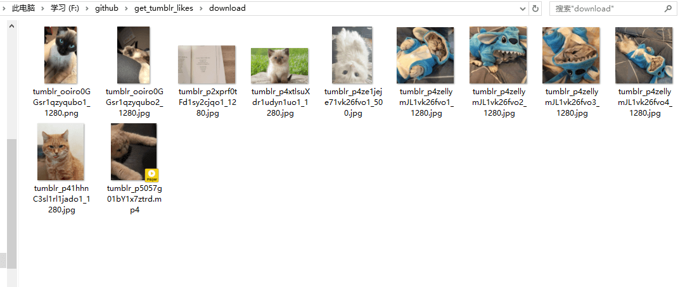
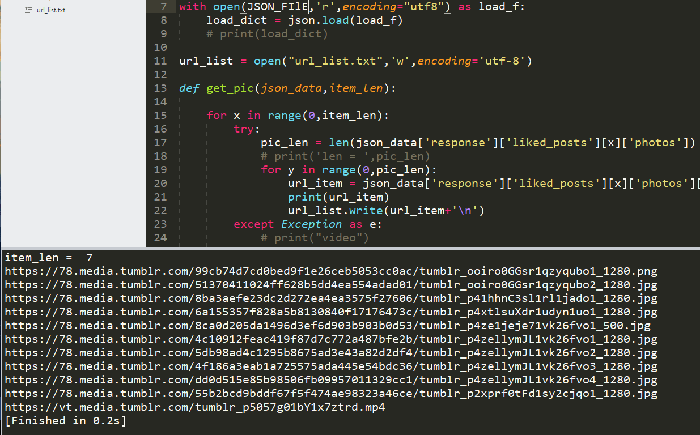
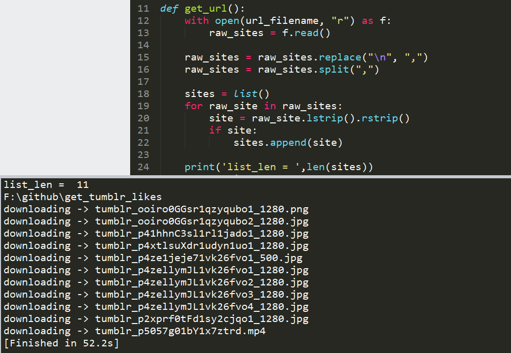

# ABSTRACT

This project could download videos and pictures that you likes in your tumblr account.
This is based on tumblr API and need authentication, so you need to get an oauth key by register an application. You can check it on [this](https://www.tumblr.com/docs/en/api/v2#auth).



# USAGE

## automation
- normal
	- `pip install -r requirements.txt`
	- `python run.py`	
- or
	- `run.exe`


## step by step

### if you have or want to have a api_key
- First, you need to get the authentication for using tumblr api, look at [that](https://www.tumblr.com/docs/en/api/v2#auth). You just need to get the authentication once when you first run this code.

- When you register an application, you will get the consumer_key and the consumer_secret. Then fill it in `get_json.py`, and run `python get_json_v2.py` to collect your likes items. By the way, you can also view the result on [this](https://api.tumblr.com/console/calls/user/likes#).

### elif turn on the ·Share posts you like· button

- `python get_json_v3.py` you can turn off share after download complete if you want.

### endif

- The return data is json type and named `likes.json`, then you need run `python json_parse.py`. This could parse the `likes.json` file and pick up the raw url about pictures and videos and write those in a `url_list.txt` file.
  


- Last, run `python download.py` to download pictures, videos in a directory named download.
  

- Simplely：1 `python get_json_v2.py` 2 `python json_parse.py` 3 `download.py`

- `download_thread.py` and `download_process.py` also could be used to download and replace `download.py`. Actually it's faster than `download.py`.

# NOTE

- Because of some reasons, you can't access tumblr in some regions. So maybe you need a proxy like me. But if you are lucky, you need to change code as follows in `download.py`.
    ```python
    # PROXIES = { "http": "http://127.0.0.1:1080", "https": "https://127.0.0.1:1080" } 
	PROXIES = {}
    ```

- This project is to download your likes pictures and videos in your account, which mean you should have an oauth key by register an application. If you just want to download pictures or videos in someone's account, you should try [this](https://github.com/dixudx/tumblr-crawler). 

- `run.exe` is pass test in win7 64bit and win10 64bit os. Using proxy by local 1080 port and download by mutil thread.
